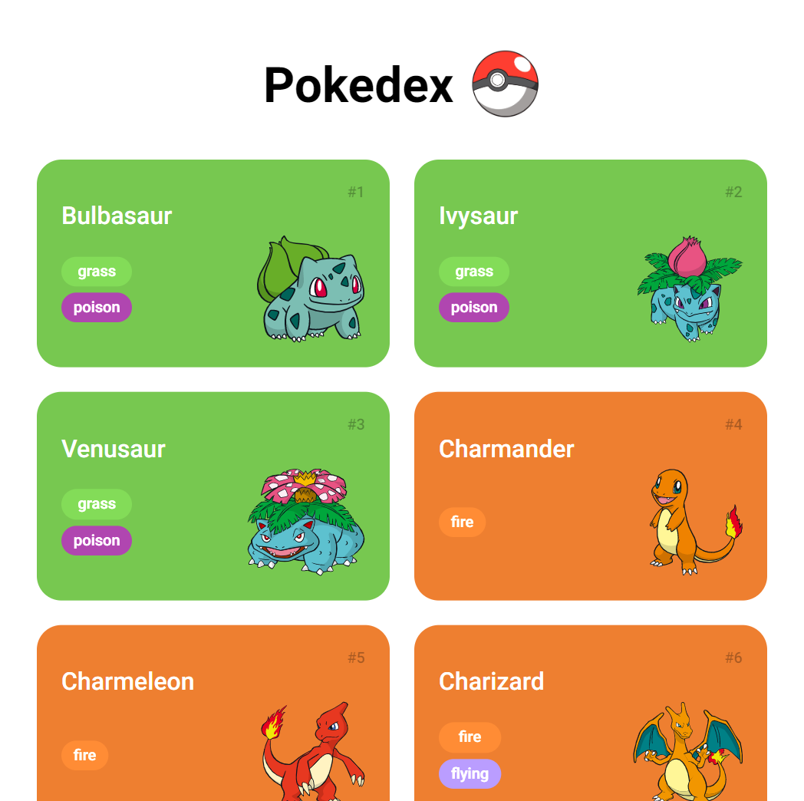

## Construindo uma Pokédex com JavaScript
## DIO

## Info:

- Project made to practice Javascript and learn how to work with API

- [PokeAPi](https://pokeapi.co/)
- [design inspired](https://dribbble.com/shots/6540871-Pokedex-App/attachments/6540871-Pokedex-App?mode=media)
- [dio](https://web.dio.me/track/orange-tech)

## Content

* Introdução a APIs
* Como funcionam as requisições
* URL Path e Method
* Path Params e Query String
* Headers
* Body e Status Code
* Introdução ao consumo da PokeApi
* Primeira requisição
* Manipulando o resultado da requisição através de uma Promise
* Transformando nossa lista de Pokémon em uma lista de HTML
* Separando o consumo da API da manipulação de HTML
* Utilizando a função Map para diminuir a verbosidade do nosso Código
* Revisando o nosso código e entendendo os próximos passos
* Manipulando múltiplas requisições em paralelo
* Convertendo o modelo do PokeApi para nosso modelo
* Adicionando os tipos de Pokémon dinamicamente
* Adicionando o botão de paginação
* Criando mecanismo de paginação
* Criando mecanismo para limitar na primeira geração de Pokémon